# LLM Abstraction + Data Flow Walkthroughs

Two things in this doc:

1. **A multi-provider LLM abstraction** that supports MiniMax, Claude, ChatGPT, and Gemini behind a single interface, with fallback routing.
2. **End-to-end visualizations** of what actually happens (network, DB, LLM, SMS) for the scenarios in [mvp.md](./mvp.md).

---

## Part 1 — LLM Provider Abstraction

### 1.1 Research summary

Reviewed the current landscape (LiteLLM, AISuite, OpenRouter, Portkey, Bifrost, custom adapter pattern). Findings:

| Tool | Maturity | Providers | Fallbacks | Structured output | Worth it? |
|---|---|---|---|---|---|
| **LiteLLM** | Production, 140+ providers | OpenAI, Anthropic, Gemini, MiniMax, Bedrock, Azure, etc. | First-class (router with chains) | Native + via Instructor | **Yes — pick this** |
| AISuite (Andrew Ng) | Newer, simpler API | Major providers | Limited | Limited | No (no streaming, no rate limits) |
| OpenRouter | Hosted gateway only | 100+ via their API | Yes | Yes | No (adds another vendor; we want local SDK) |
| Portkey | Hosted + SDK | 200+ | Yes | Yes | No (overkill at N=1) |
| Custom adapters | DIY | Whatever you write | Whatever you write | Whatever you write | No (LiteLLM already wrote this) |

**Decision: LiteLLM as the backbone, wrapped in a thin local interface.**

Why the wrapper, not LiteLLM directly:
- Code outside `llm/` should not import `litellm`. If we ever swap (cost, license, features), only the adapter changes.
- Lets us add eval hooks, structured logging, prompt-versioning interceptors *once*, around all calls.
- Makes the test seam clean — mock the local `LLMClient`, not the LiteLLM module.

### 1.2 Pattern: Strategy + Factory + Router

Three layers, top to bottom:

```
   Application code
        │
        ▼
   ┌───────────────────────────────┐
   │  LLMClient (Strategy facade)  │   ← what app code uses
   │  - classify(text, schema)     │
   │  - warm_ack(context)          │
   │  - summarize(rows, schema)    │
   └──────────────┬────────────────┘
                  │
                  ▼
   ┌───────────────────────────────┐
   │  RouterPolicy                 │   ← picks model + handles fallback chain
   │  - by call type (cheap/heavy) │
   │  - by cost / latency budget   │
   │  - by provider availability   │
   └──────────────┬────────────────┘
                  │
                  ▼
   ┌───────────────────────────────┐
   │  ProviderAdapter (LiteLLM)    │   ← actual SDK call
   │  - claude / gpt / gemini /    │
   │    minimax via litellm        │
   └───────────────────────────────┘
```

### 1.3 Concrete shape

```python
# llm/types.py
from enum import Enum
from pydantic import BaseModel
from typing import Any

class CallType(str, Enum):
    CLASSIFY     = "classify"      # fast, cheap, structured
    WARM_ACK     = "warm_ack"      # fast, free-form, short
    PUSHBACK     = "pushback"      # slow ok, quality matters
    INTERNAL_TRIG = "internal_trig"
    SUMMARY      = "summary"       # slow, long output, quality matters

class LLMRequest(BaseModel):
    call_type: CallType
    system: str
    user: str                       # ALWAYS wrapped in <user_input> by caller
    schema: type[BaseModel] | None = None   # for structured output
    max_tokens: int = 500

class LLMResponse(BaseModel):
    text: str | None = None
    parsed: Any = None             # populated when schema given
    model_used: str
    provider: str
    latency_ms: int
    fallback_used: bool = False
    prompt_version: str
    request_id: str
```

```python
# llm/router.py
from dataclasses import dataclass

@dataclass(frozen=True)
class ModelChoice:
    provider: str          # "anthropic" | "openai" | "google" | "minimax"
    model: str             # litellm-format string, e.g. "claude-haiku-4-5"
    soft_timeout_s: float
    hard_timeout_s: float

class RouterPolicy:
    """Maps (call_type) → ordered list of model choices for fallback chain."""

    POLICY: dict[CallType, list[ModelChoice]] = {
        CallType.CLASSIFY: [
            ModelChoice("anthropic", "claude-haiku-4-5-20251001",        2.0, 5.0),
            ModelChoice("openai",    "gpt-4.1-mini",                     2.5, 5.0),
            ModelChoice("google",    "gemini-2.5-flash",                 2.0, 5.0),
            ModelChoice("minimax",   "minimax-m2.5",                     3.0, 6.0),
        ],
        CallType.WARM_ACK: [
            ModelChoice("anthropic", "claude-haiku-4-5-20251001",        2.0, 5.0),
            ModelChoice("openai",    "gpt-4.1-mini",                     2.5, 5.0),
        ],
        CallType.PUSHBACK: [
            ModelChoice("anthropic", "claude-sonnet-4-6",                4.0, 8.0),
            ModelChoice("openai",    "gpt-4.1",                          5.0, 8.0),
            ModelChoice("google",    "gemini-2.5-pro",                   5.0, 8.0),
        ],
        CallType.INTERNAL_TRIG: [
            ModelChoice("anthropic", "claude-sonnet-4-6",                4.0, 8.0),
            ModelChoice("openai",    "gpt-4.1",                          5.0, 8.0),
        ],
        CallType.SUMMARY: [
            ModelChoice("anthropic", "claude-sonnet-4-6",                15.0, 30.0),
            ModelChoice("openai",    "gpt-4.1",                          15.0, 30.0),
            ModelChoice("google",    "gemini-2.5-pro",                   15.0, 30.0),
        ],
    }

    def chain_for(self, call_type: CallType) -> list[ModelChoice]:
        return self.POLICY[call_type]
```

```python
# llm/adapters/litellm_adapter.py
import litellm
from instructor import from_litellm

class LiteLLMAdapter:
    """One-stop adapter. LiteLLM handles per-provider quirks and SDK calls."""

    def __init__(self):
        self._instructor = from_litellm(litellm.completion)

    async def call(self, choice: ModelChoice, req: LLMRequest) -> LLMResponse:
        model_id = self._litellm_model_string(choice)
        messages = [
            {"role": "system", "content": req.system},
            {"role": "user",   "content": req.user},
        ]

        if req.schema:
            # Structured: use Instructor on top of LiteLLM
            parsed = await self._instructor.chat.completions.create(
                model=model_id,
                response_model=req.schema,
                messages=messages,
                max_tokens=req.max_tokens,
                timeout=choice.hard_timeout_s,
            )
            return LLMResponse(parsed=parsed, ...)
        else:
            resp = await litellm.acompletion(
                model=model_id,
                messages=messages,
                max_tokens=req.max_tokens,
                timeout=choice.hard_timeout_s,
            )
            return LLMResponse(text=resp.choices[0].message.content, ...)

    def _litellm_model_string(self, choice: ModelChoice) -> str:
        # LiteLLM uses a "provider/model" or just "model" string convention
        # Examples:
        #   anthropic/claude-haiku-4-5-20251001
        #   gpt-4.1-mini             (openai default)
        #   gemini/gemini-2.5-flash  (google)
        #   minimax/minimax-m2.5     (via openai-compatible base_url)
        return f"{choice.provider}/{choice.model}" if choice.provider != "openai" else choice.model
```

```python
# llm/client.py
import asyncio
from time import perf_counter

class LLMClient:
    """The only thing app code sees."""

    def __init__(self, router: RouterPolicy, adapter: LiteLLMAdapter, logger):
        self.router = router
        self.adapter = adapter
        self.log = logger

    async def call(self, req: LLMRequest) -> LLMResponse:
        chain = self.router.chain_for(req.call_type)
        last_err = None

        for i, choice in enumerate(chain):
            t0 = perf_counter()
            try:
                resp = await asyncio.wait_for(
                    self.adapter.call(choice, req),
                    timeout=choice.hard_timeout_s,
                )
                resp.latency_ms = int((perf_counter() - t0) * 1000)
                resp.fallback_used = (i > 0)
                self.log.info(
                    event="llm_call_ok",
                    request_id=req.request_id,
                    provider=choice.provider,
                    model=choice.model,
                    latency_ms=resp.latency_ms,
                    fallback_step=i,
                    call_type=req.call_type.value,
                )
                return resp
            except (asyncio.TimeoutError, Exception) as e:
                last_err = e
                self.log.warning(
                    event="llm_call_failed",
                    request_id=req.request_id,
                    provider=choice.provider,
                    error=type(e).__name__,
                    fallback_step=i,
                )
                continue

        # All providers failed — caller decides degraded behavior
        raise LLMAllProvidersFailed(last_err)
```

### 1.4 Provider configuration

`.env`:
```
ANTHROPIC_API_KEY=sk-ant-...
OPENAI_API_KEY=sk-...
GEMINI_API_KEY=...
MINIMAX_API_KEY=...
MINIMAX_API_BASE=https://api.minimax.io/v1
```

LiteLLM picks these up automatically by env-var convention. MiniMax is OpenAI-compatible — point its base URL accordingly. (MiniMax also has an Anthropic-compatible endpoint at `/anthropic` if you prefer.)

### 1.5 Why this satisfies the requirements

- ✅ **Switch model config:** edit `RouterPolicy.POLICY` — one place.
- ✅ **Switch provider:** edit `RouterPolicy.POLICY` — same place.
- ✅ **MiniMax / Claude / ChatGPT / Gemini** all supported via LiteLLM out of the box.
- ✅ **Fallback routing:** `LLMClient.call` walks the chain on failure, logs each step.
- ✅ **App code stays clean:** handlers call `llm.call(LLMRequest(call_type=..., ...))` and don't know which provider answered.
- ✅ **Structured output works across providers** via Instructor, which sits on top of LiteLLM.

### 1.6 What changes in the build checklist

The Sunday-morning step "LLM call for vague-reply pushback" expands to:
1. Add `litellm`, `instructor`, `pydantic` to deps.
2. Implement `llm/types.py`, `llm/router.py`, `llm/adapters/litellm_adapter.py`, `llm/client.py` (~150 LOC total).
3. Pull all `llm.call()` invocations through this client.
4. Add `MINIMAX_API_KEY` etc. to `.env.example`.

Total time delta: maybe 1 extra hour vs. hard-coding Anthropic. Pays for itself the first time Claude has a regional outage.

---

## Part 2 — Data Flow Visualizations

All diagrams use Mermaid. They render in GitHub, VS Code (with extensions), Obsidian, etc.

### 2.1 The big picture (system context)

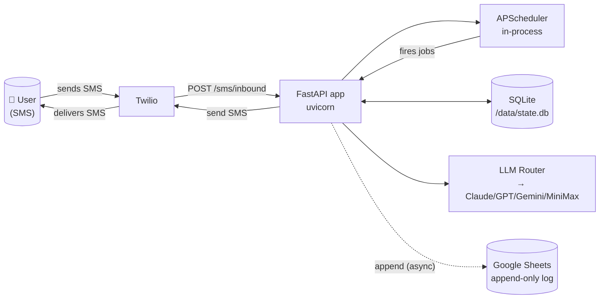

### 2.2 Inbound message — full pipeline

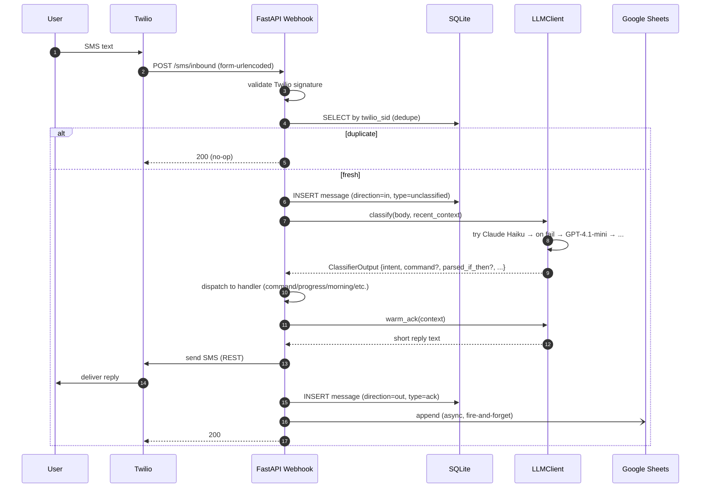

### 2.3 Timer lifecycle (state machine)

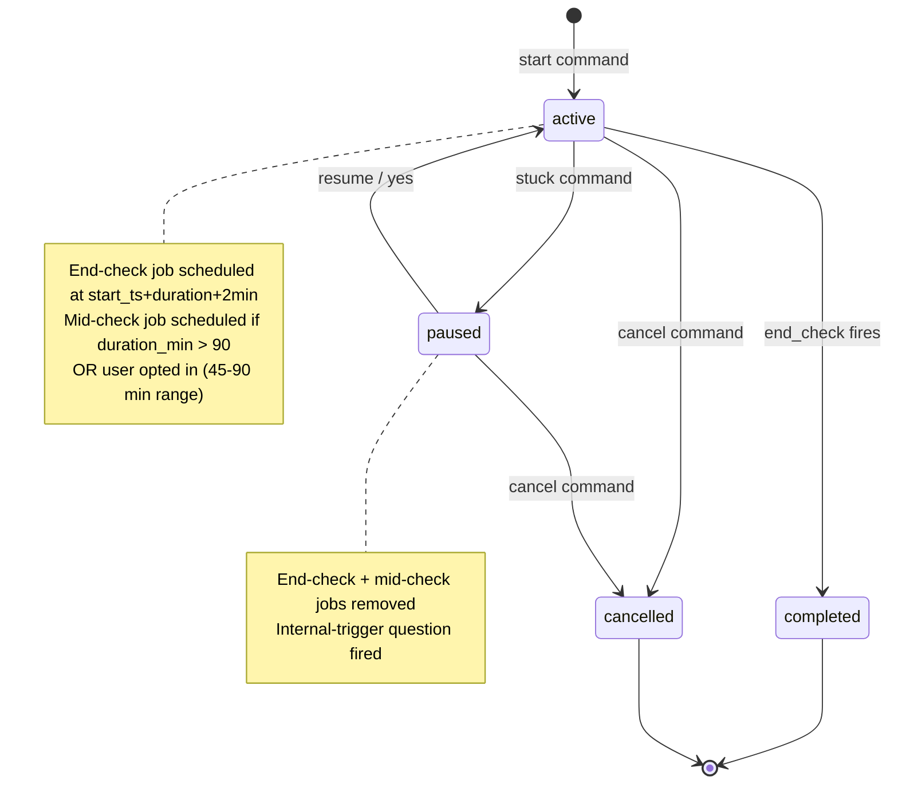

### 2.4 Scheduled jobs across a typical day

```mermaid
gantt
    dateFormat HH:mm
    title One day in Overwatcher (user TZ)
    axisFormat %H:%M

    section Daily fixed
    Morning prompt    :09:00, 1m
    Heartbeat row     :12:00, 1m
    Evening prompt    :21:00, 1m

    section User-triggered
    Timer: design 30min start  :10:00, 1m
    Timer: design end-check    :crit, 10:32, 2m
    Timer: write 2hr start     :13:00, 1m
    Timer: write mid-check     :14:00, 1m
    Timer: write end-check     :crit, 15:02, 2m

    section Friday only
    Weekly summary    :17:00, 1m
```

### 2.5 LLM router decision flow

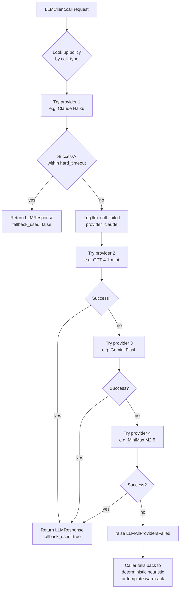

---

## Part 3 — End-to-End Examples

Each example shows: SMS thread + sequence diagram + relevant DB rows. Times in user local TZ.

---

### Example 1 — Happy morning (user replies cleanly with if-then)

**SMS thread**
```
09:00  → User: "Good morning. What are your top 1-3 items for today?
                Try if-then format — e.g. 'if it's 10am, then I open
                the design doc and do 30 min on section 2.'"

09:04  ← User: "if it's 10am, then 30 min on design section 2.
                if it's 11am, then prompt CC to draft the API."

09:04  → User: "Sharp plan. Want me to check back at 10:32?"

09:04  ← User: "yes"

09:04  → User: "Done. Also tracking 11am for the API prompt. Go."
```

**Backend sequence**

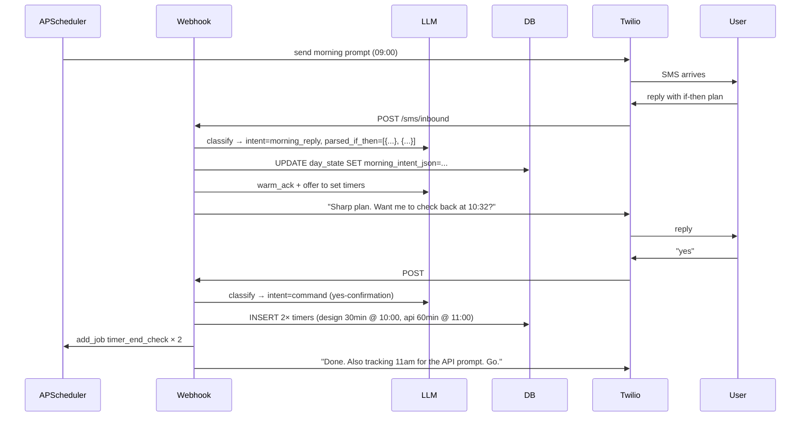

**DB after**
```
day_state[2026-04-13]: mode=bookend, morning_intent_json=[{if:"10am", then:"30min on design"}, {if:"11am", then:"prompt CC for API"}]
timers[1]: task=design,  duration=30, start=10:00, end_scheduled=10:32, status=active
timers[2]: task=api,     duration=60, start=11:00, end_scheduled=12:02, status=active
```

---

### Example 2 — Vague morning reply → if-then pushback

**SMS thread**
```
09:00  → User: "Good morning. What are your top 1-3 items..."
09:02  ← User: "work on the app today"
09:02  → User: "Too broad for a day. Turn it into an if-then so it
                 triggers on its own — what's the situation and the first
                 action?"
09:05  ← User: "if it's 10am, then I open feedback-cycles.md and read
                 it for 20 min."
09:05  → User: "Better. Locked in. Want me to ping at 10:22?"
09:06  ← User: "no, just at 9pm"
09:06  → User: "Got it. See you tonight."
```

**Backend sequence**

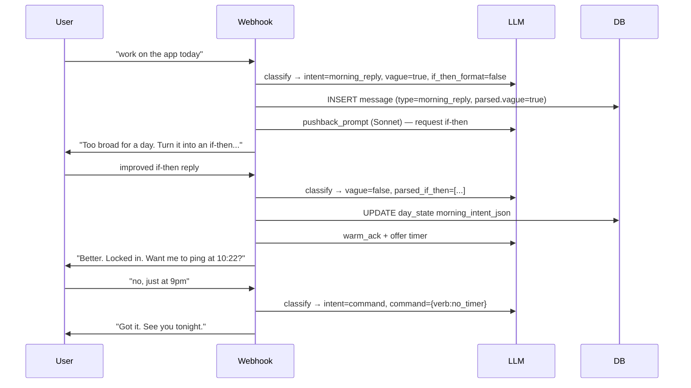

Note: pushback fires once, then accepts whatever comes back. Never twice.

---

### Example 3 — User starts a timer mid-day, mid-check fires (long block)

**SMS thread**
```
13:00  ← User: "start writing 2hr"
13:00  → User: "Timer set. 2 hr on writing. Go."
14:00  → User: "Halfway through writing. On track? yes / stuck / switching"
14:01  ← User: "yes, hit my stride"
14:01  → User: "Nice, keep going. End-check at 15:02."
15:02  → User: "2 hr on writing — how'd it go? Done, keep going, or stuck?"
15:03  ← User: "done. got 80% of the section drafted, will polish tonight."
15:03  → User: "Solid. Logged."
```

**Backend sequence**

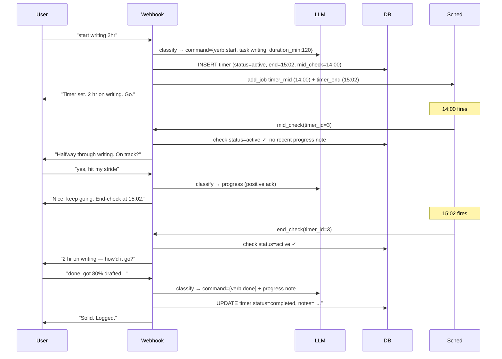

---

### Example 4 — `stuck` during an active timer (the high-leverage flow)

**SMS thread**
```
10:00  ← User: "start design 45min"
10:00  → User: "Timer set. 45 min on design. Go."
10:18  ← User: "stuck"
10:18  → User: "Paused. What were you feeling right before — bored, anxious,
                unsure where to start?"
10:19  ← User: "unsure. the section header doesn't make sense."
10:19  → User: "OK. Smallest next step: write one bad sentence under the
                header and move on. Resume timer? (~27 min left)"
10:20  ← User: "yes"
10:20  → User: "Resumed. End-check at 10:49."
10:49  → User: "Design — how'd it go?"
10:50  ← User: "way better. unstuck once I started writing trash."
10:50  → User: "That's the move. Logged."
```

**Backend sequence**

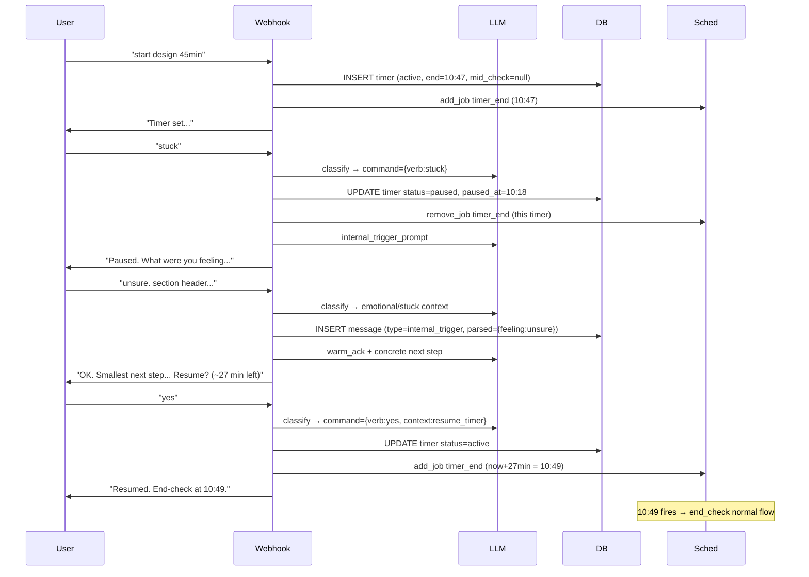

This is the most product-shaped flow in the whole system. The internal-trigger row is gold for the Friday summary.

---

### Example 5 — Implicit timer parsed from morning intent

**SMS thread**
```
09:00  → User: "Good morning..."
09:03  ← User: "if it's 10am, then I do 30 min on the API design,
                then 45 min coding the endpoint."
09:03  → User: "Two solid blocks. Want me to ping at 10:32 and 11:17?"
09:04  ← User: "yes both"
09:04  → User: "Tracking both. First ping at 10:32. Go win."
```

**Backend sequence**

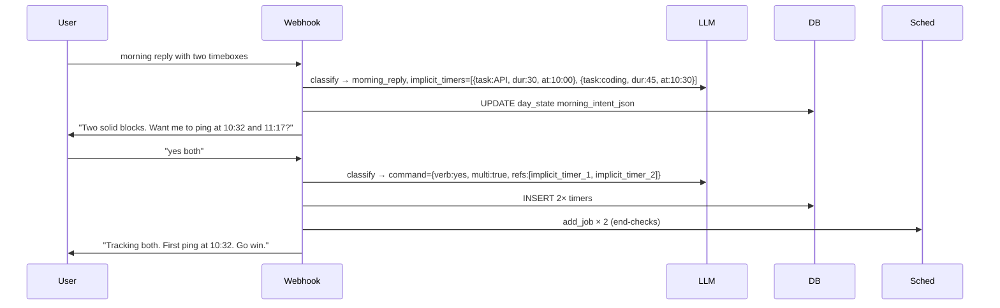

---

### Example 6 — Evening reality with drift → internal-trigger followup

**SMS thread**
```
21:00  → User: "How did today go? What happened with: API design, coding endpoint?"
21:08  ← User: "API design done. coding got derailed, ended up watching streams
                for 90min after lunch."
21:08  → User: "Got it. What were you feeling right before the streams started?
                Bored, stuck, avoiding, just tired?"
21:10  ← User: "stuck on the auth flow, didn't want to admit i didn't know how
                to start."
21:10  → User: "Useful flag. Logged. We can break the auth flow into a tiny
                first step tomorrow if you want. Sleep well."
```

**Backend sequence**

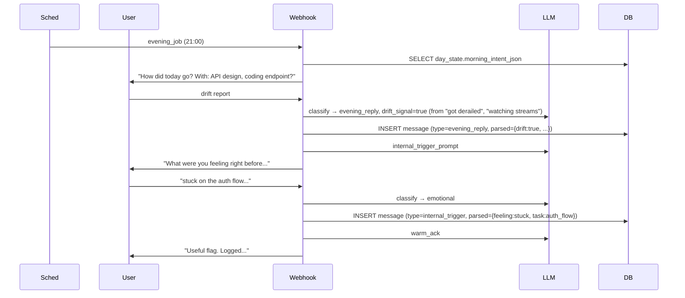

Friday summary will likely surface: "2 of 5 days, drift followed 'stuck on hard task' with no concrete first step."

---

### Example 7 — Friday summary

**SMS (the only user-facing message, ~5 sentences)**
```
17:00  → User: "Week recap: planned 12 if-then items, hit 8.
                Pattern: 2× this week, drift followed 'stuck on hard task'
                — same shape as last Tuesday. The fix that worked Wednesday
                was breaking the task into one bad first sentence. Strong
                stretch on writing (3 hrs Tue + 2 hrs Thu, both hit). This
                was a week where you showed up as someone who ships drafts."
```

**Backend sequence**

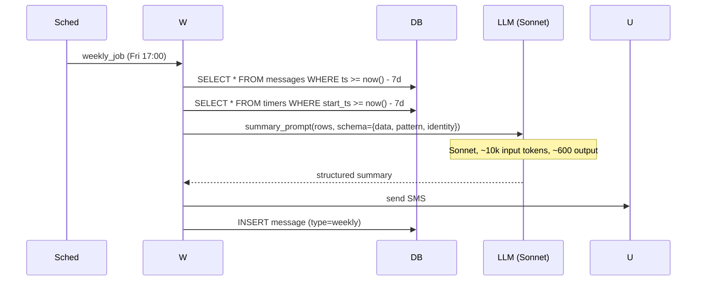

---

### Example 8 — Failure: Claude rate-limited → falls over to GPT

**Visible to user: nothing different.** Reply takes ~1.5s longer than usual.

**Backend sequence**

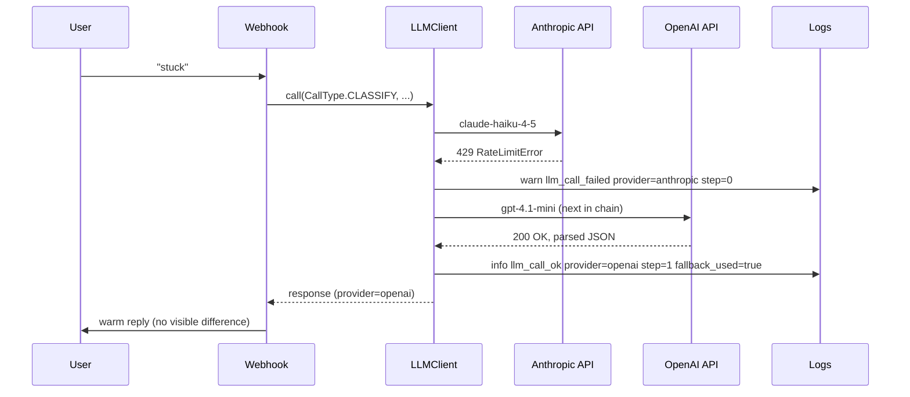

The Sheets row for that message will have `parsed.fallback_used=true, parsed.provider=openai`. Friday summary doesn't surface this; the daily heartbeat row's error_count_24h will.

---

### Example 9 — Failure: Twilio webhook duplicate (retry storm)

**Visible to user: nothing.** Single reply, one row in DB, one append in Sheets.

**Backend sequence**

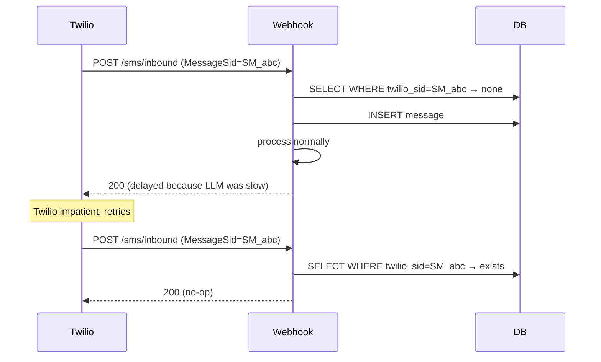

---

### Example 10 — User says `quiet` → silence respected for 3 hr

**SMS thread**
```
14:30  ← User: "quiet 2hr"
14:30  → User: "Quiet till 16:30. Text me anytime to wake me."

14:55  ← User: "halfway through cooking, all good"
[no SMS reply — logged as progress, no ack sent]

16:30  → User: "Back. How'd it go?"
```

**Backend sequence (during quiet)**

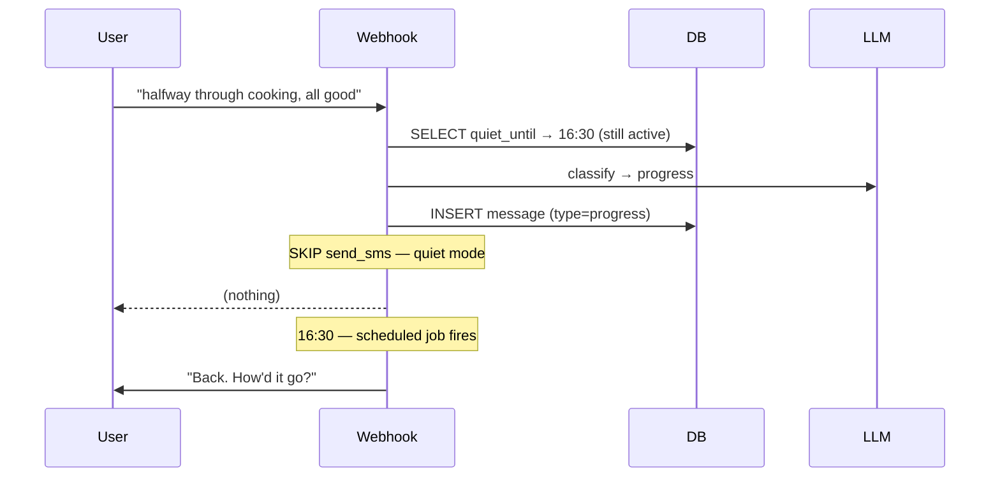

---

### Example 11 — Cold start (very first user message ever)

**SMS thread**
```
09:32  ← User: "hey, testing"
09:32  → User: "First time, welcome. The morning prompt usually fires
                at 9am — looks like you missed it today. Want to log
                an intent now, or wait till tomorrow?"
09:33  ← User: "log now: if it's 10am, then 1hr on Overwatcher coding."
09:33  → User: "Locked in. Check back at 11:02?"
09:33  ← User: "yes"
09:34  → User: "Done. Welcome aboard."
```

**Backend behavior:**
- Webhook checks `day_state[today]` → no row → bootstrap branch.
- Classifier still runs; intent=`progress` initially.
- Bootstrap handler creates `day_state` row with mode=bookend, then re-prompts for the morning intent inline.
- Subsequent reply parsed as morning_reply (because `day_state.morning_intent_json IS NULL`).

---

## Part 4 — Reference: state across one full day

Compact view of what gets written, when:

| Time | Event | Tables touched | LLM call? |
|---|---|---|---|
| 09:00 | Morning job fires | `messages`(out), `day_state` upsert | no |
| 09:04 | User reply | `messages`(in), `day_state` updated | classify + warm_ack |
| 09:04 | (if vague) pushback | `messages`(out, type=followup) | pushback (Sonnet) |
| 09:05 | Implicit timer accepted | `timers`(insert), `apscheduler_jobs` | classify (yes-confirm) |
| 10:32 | Timer end-check fires | `messages`(out, type=timer_check) | no |
| 10:33 | User replies "done" | `messages`(in), `timers`(complete) | classify + warm_ack |
| 12:00 | Daily heartbeat | `messages`(out, type=heartbeat) | no |
| 14:00 | Mid-check on 2hr timer | `messages`(out, type=mid_check) | no |
| 21:00 | Evening job | `messages`(out, type=evening) | no |
| 21:08 | Drift reply | `messages`(in) | classify |
| 21:08 | Internal-trigger followup | `messages`(out, type=followup) | internal_trig (Sonnet) |
| 21:10 | User reply | `messages`(in, type=internal_trigger) | classify + warm_ack |
| Fri 17:00 | Weekly summary | `messages`(out, type=weekly) | summary (Sonnet, ~10k tokens) |

Total LLM calls on a typical day: ~10-15. Cost: < $0.15/day at N=1.

---

## Sources

- [LiteLLM — GitHub (BerriAI/litellm)](https://github.com/BerriAI/litellm)
- [LiteLLM docs](https://docs.litellm.ai/docs/)
- [LiteLLM Router & Load Balancing](https://docs.litellm.ai/docs/routing-load-balancing)
- [LiteLLM MiniMax provider](https://docs.litellm.ai/docs/providers/minimax)
- [What is LiteLLM (2026 guide)](https://a2a-mcp.org/blog/what-is-litellm)
- [AISuite (Andrew Ng) — InfoQ writeup](https://www.infoq.com/news/2024/12/aisuite-cross-llm-api/)
- [Failover routing strategies for LLMs in production — Portkey](https://portkey.ai/blog/failover-routing-strategies-for-llms-in-production/)
- [LLM Gateway Architecture — Collin Wilkins](https://collinwilkins.com/articles/llm-gateway-architecture)
- [OpenRouter Provider Routing](https://openrouter.ai/docs/guides/routing/provider-selection)
- [MiniMax OpenAI-compatible API](https://platform.minimax.io/docs/api-reference/text-openai-api)
- [Instructor — structured outputs across providers](https://python.useinstructor.com/)
